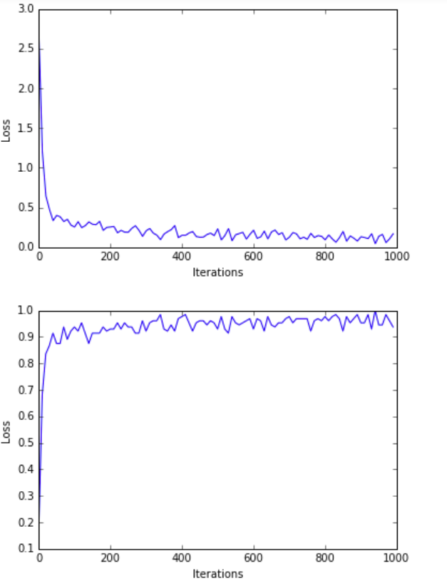
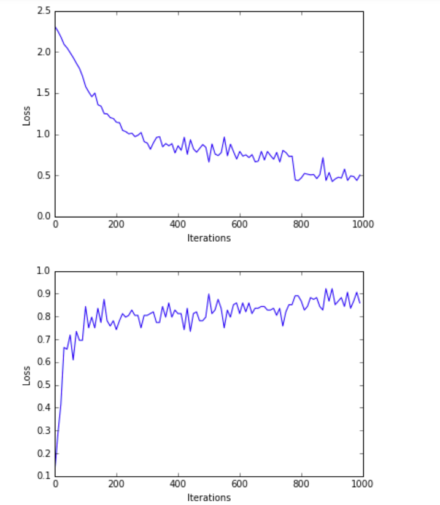

https://drive.google.com/open?id=16B0xQYHhCgK8uhbW09cba6v0ZFaMMZ8a
## Получение данных
Скачал данные отсюда, данные просто загружены с MNIST в CSV  :- https://pjreddie.com/projects/mnist-in-csv/.

## Загрузка данных
1) Скрипт, dataloader.py помогает перевести данные csv -> numpy .
2) Проверить правильность приведенных выше шагов, запустив скрипт
3) Для сценария требуются два пользовательских ввода
  а) datapath =  путь к папке с данными, внутри которой хранятся файлы MNIST CSV. <br />
  б) mode = 'train' или 'test'для извлечения учебных или тестовых данных<br />
  в) Например :-<br />
      ```python
          python dataloader.py ./data test
       ```
 
## Обучение модели
1) Скрипт  nn.py  nn.py содержит все API-интерфейсы, используемые для обучения модели, сохранение модели и выполнение тестовых данных
2) Для сценария требуются три пользовательских ввода:<br />
    а)   mode = 'train' or 'test' <br />
    б)  datapath =  путь к папке с данными, внутри которой хранятся файлы MSTIST CSV.  <br />
    в) modelpath =  путь для хранения обученного веса или загрузки весов во время испытания <br />
    
    г) Example:-
    
        ```python
            python nn.py train ./data ./new_model
        ```
        
    д) возможные проблемы:-
              Exception : Not able to parse MNIST Data
       побился файлик с данными, надо перекачать

## Testing the model
1) Я уже представил обучаемую модель внутри папки модели и тестовые данные внутри папки данных.
2) Для начала используйте команду follwing.
    
    ```python
        python nn.py test ./data ./model_bn
    ```

  Если все настроено правильно, вы должны увидеть следующие результаты на консоли. <br />
                        Loading Dataset===><br />
                        Done!<br />
                        Loading Trained Weights......<br />
                        Testing Iteration===>0, Acc ====>0.9766<br />
                        Testing Iteration===>1, Acc ====>0.9609<br />
                        Testing Iteration===>2, Acc ====>0.9844<br />
                        Testing Iteration===>3, Acc ====>0.9766<br />
                        Testing Iteration===>4, Acc ====>0.9531<br />
                        Testing Iteration===>5, Acc ====>0.9531<br />
                        Testing Iteration===>6, Acc ====>0.9453<br />
                        Testing Iteration===>7, Acc ====>0.9844<br />
                        Testing Iteration===>8, Acc ====>0.9687<br />
                        Testing Iteration===>9, Acc ====>0.9609<br />
                        Testing Iteration===>10, Acc ====>0.9844<br />
                        Testing Iteration===>11, Acc ====>0.9297<br />
                        Testing Iteration===>12, Acc ====>0.9531<br />
                        Testing Iteration===>13, Acc ====>0.9531<br />
                        Testing Iteration===>14, Acc ====>0.9297<br />
                        Testing Iteration===>15, Acc ====>0.9453<br />
                        Testing Iteration===>16, Acc ====>0.9687<br />
                        Testing Iteration===>17, Acc ====>0.9766<br />
                        Testing Iteration===>18, Acc ====>0.9531<br />
                        Testing Iteration===>19, Acc ====>0.9141<br />
                        Testing Iteration===>20, Acc ====>0.9766<br />
                        Testing Iteration===>21, Acc ====>0.9922<br />
                        Testing Iteration===>22, Acc ====>0.9219<br />
                        Testing Iteration===>23, Acc ====>0.9531<br />
                        Testing Iteration===>24, Acc ====>0.9922<br />
                        Testing Iteration===>25, Acc ====>0.9687<br />
                        Testing Iteration===>26, Acc ====>0.9531<br />
                        Testing Iteration===>27, Acc ====>0.8984<br />
                        Testing Iteration===>28, Acc ====>0.9687<br />
                        Testing Iteration===>29, Acc ====>0.9453<br />
                        Testing Iteration===>30, Acc ====>0.9453<br />
                        Testing Iteration===>31, Acc ====>0.9453<br />
                        Testing Iteration===>32, Acc ====>0.9531<br />
                        Testing Iteration===>33, Acc ====>0.9687<br />
                        Testing Iteration===>34, Acc ====>0.9844<br />
                        Testing Iteration===>35, Acc ====>0.9766<br />
                        Testing Iteration===>36, Acc ====>0.9766<br />
                        Testing Iteration===>37, Acc ====>0.9687<br />
                        Testing Iteration===>38, Acc ====>0.9375<br />
                        Testing Iteration===>39, Acc ====>0.9687<br />
                        Testing Iteration===>40, Acc ====>0.9687<br />
                        Testing Iteration===>41, Acc ====>0.9609<br />
                        Testing Iteration===>42, Acc ====>0.9844<br />
                        Testing Iteration===>43, Acc ====>0.9453<br />
                        Testing Iteration===>44, Acc ====>0.9531<br />
                        Testing Iteration===>45, Acc ====>0.9687<br />
                        Testing Iteration===>46, Acc ====>0.9687<br />
                        Testing Iteration===>47, Acc ====>0.9766<br />
                        Testing Iteration===>48, Acc ====>0.9609<br />
                        Testing Iteration===>49, Acc ====>0.9766<br />
                        Testing Iteration===>50, Acc ====>0.9531<br />
                        Testing Iteration===>51, Acc ====>0.9922<br />
                        Testing Iteration===>52, Acc ====>0.9453<br />
                        Testing Iteration===>53, Acc ====>0.9766<br />
                        Testing Iteration===>54, Acc ====>0.9531<br />
                        Testing Iteration===>55, Acc ====>0.9453<br />
                        Testing Iteration===>56, Acc ====>0.9453<br />
                        Testing Iteration===>57, Acc ====>0.9453<br />
                        Testing Iteration===>58, Acc ====>0.9219<br />
                        Testing Iteration===>59, Acc ====>0.9609<br />
                        Testing Iteration===>60, Acc ====>0.9531<br />
                        Testing Iteration===>61, Acc ====>0.9609<br />
                        Testing Iteration===>62, Acc ====>0.9297<br />
                        Testing Iteration===>63, Acc ====>0.9687<br />
                        Testing Iteration===>64, Acc ====>0.9297<br />
                        Testing Iteration===>65, Acc ====>0.9766<br />
                        Testing Iteration===>66, Acc ====>0.9687<br />
                        Testing Iteration===>67, Acc ====>0.9453<br />
                        Testing Iteration===>68, Acc ====>0.9531<br />
                        Testing Iteration===>69, Acc ====>0.9219<br />
                        Testing Iteration===>70, Acc ====>0.9531<br />
                        Testing Iteration===>71, Acc ====>0.9531<br />
                        Testing Iteration===>72, Acc ====>0.9531<br />
                        Testing Iteration===>73, Acc ====>0.9531<br />
                        Testing Iteration===>74, Acc ====>0.9297<br />
                        Testing Iteration===>75, Acc ====>0.9531<br />
                        Testing Iteration===>76, Acc ====>0.9297<br />
                        Testing Iteration===>77, Acc ====>0.9687<br />

## Запуск на образцах изображений
1) Некоторые изображения из MNIST лежат в images.
2) Для работы скрипта, надо поставить OpenCV
3) Пример запуска :-
  
  ```python
      python run_on_image.py images/img_4.png ./model_bn/
  ```  
## Характеристики модели
1) Кол-во скрытых слоев - 2
2) Скрытые уровни слоя - (1024,2048)
3) Уровень обучения - 0.001
4) Размер пакета - 128
5) Максимальные итерации для обучения - 1000000
6) Скорость распада нормальной пакетизации - 0.9

## Observations
1) Более быстрая сходимость и более высокая точность с использованием пакетной нормализации перед операцией Relu как видно на графиках
2) Эксперименты с увеличением скрытых слоев и размеров могут помочь нам найти лучшее значения, где мы не недообучаем и не переобучаем.

## Кривые потерь и точности с пакетной нормализацией


## Кривые потерь и точности без пакетной нормализацией


